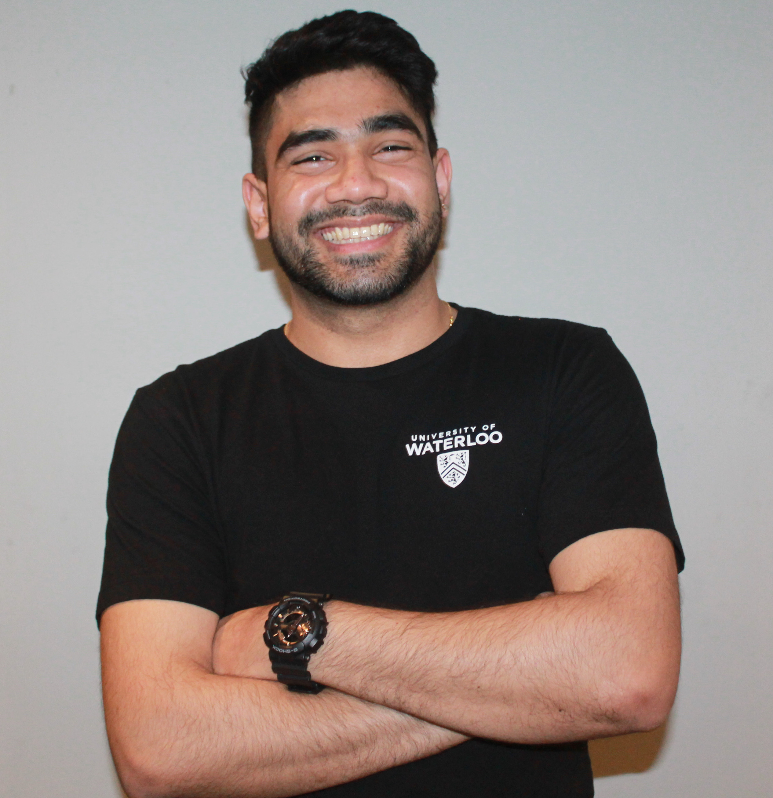

# About me

 

Hello! My name is Shubham Bishnoi. I just completed my Statistics Honours degree with a Computer Science minor from University of Waterloo. Few things that interest me are data visualization, A/B testing and working with databases. I am looking for a respectful and creative work environment and team that challenge me to learn new things. I aspire to teach Data Science and Ethics in the future. 

# Contact Information

| [Resume](./stuff/shubham_bishnoi.pdf) |  | [shubhambishnoi](https://www.linkedin.com/in/shubhambishnoi/) |  | [shubishnoi@gmail.com](mailto:shubishnoi@gmail.com) |  | 519-781-5497 |

# Projects

| Name | Description | Skills | Link |
| :---: | :---: | :---: | :---: |
| **Experimental Design** | The project is on experimenting with different features of the online streaming service to reduce the average browsing time. |  *A/B Testing and Hypothesis testing in R* | [Link](./projects/ExperimentalDesign/) |
| **Database Design** | This project is on creating a database that could be used by people to do basic and advanced SQL queries. The database is in 3rd Normal form and most of the data is original (created manually). |  *Entity Relation Diagram, Relational model and SQL queries in SQLite* | [Link](./projects/DatabaseDesign/) |
| **Prediction Model** | This project is on creating a prediction model for happiness of people based on attributes given. The achieved accuracy was 80.81%. |  *Feature Engineering, Generalized Linear Model, Random Forest Model, Deep Learning Model and Stacking in R using h2o library* | [Link](./projects/PredictionClassificationModels) |
| **Data Visualization** | This project is on visualizing Canada provinces' COVID-19 data in a form of running bar graph |  *Pandas, Numpy and Matplotlib libraries in Jupyter* | [Link](./projects/DataVisualization) |

# Full Time Work Experience

| Title | Company | Location | Start | End |
| :---: | :---: | :---: | :---: | :---: |
| **Business Insights & Analytics Associate** | *TD Canada Trust* |  Toronto, Ontario | Feb,21 | Current |
| **Data Analyst** | *Brookfield Asset Management* |  Toronto, Ontario | Oct,20 | Jan,21 |

# Co-op Work Experience

| Title | Company | Location | Start | End |
| :---: | :---: | :---: | :---: | :---: |
| **Data Scientist** | *Pinpoint* |  Austin, Texas | Sep,19 | Dec,19 |
| **Data Analyst** | *Jana Solutions* |  Aurora, Ontario | Jan,19 | Apr,2019 |
| **Math Tutor** | *Humber College* |  Etobicoke, Ontario | May,18 | Aug,18 |
| **Teacher Intern** | *Bronte College* |  Missisauga, Ontario | Sep,17 | Dec,17 |
| **Math Resource Assistant** | *Mohawk College* |  Hamilton, Ontario | Jan,17 | Apr,17 |

# Part Time Work Experience

| Title | Company | Location | Start | End |
| :---: | :---: | :---: | :---: | :---: |
| **Data Scientist** | *Pinpoint* |  Austin, Texas | Jan,20 | Mar,20 |
| **Front Desk Assistant** | *UW Desk Services* | Waterloo, Ontario | Jan,20 | Aug,20 |
| **Front Desk Assistant** | *UW Desk Services* | Waterloo, Ontario | May,19 | Aug,19 |
| **Front Desk Trainer** | *UW Desk Services* | Waterloo, Ontario | Sep,18 | Dec,18 |
| **Front Desk Assistant** | *UW Desk Services* | Waterloo, Ontario | Jan,18 | Apr,18 |
| **Front Desk Assistant** | *UW Desk Services* | Waterloo, Ontario | May,17 | Aug,17 |