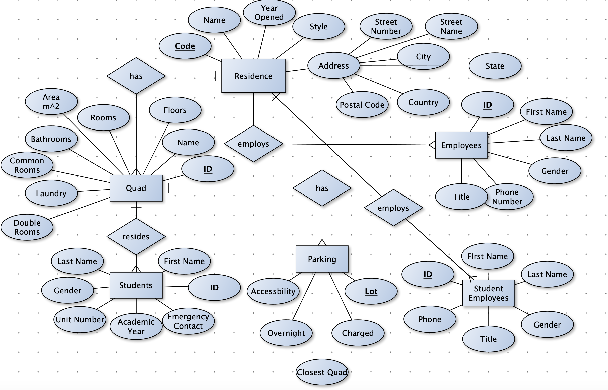

[< Back to the portfolio](https://s-bishnoi.github.io/shubham-bishnoi/)
[< Back to the projects](https://s-bishnoi.github.io/shubham-bishnoi/projects/)

# Database Design

- Link to download database
- Overview
- Creating the database
- Basic SQL queries
- Advanced SQL queries
- Normalization of the database
- References

## Link to download database

[Here](https://github.com/s-bishnoi/shubham-bishnoi/blob/master/projects/DatabaseDesign/ResidenceDatabase.db)
 
## Overview

The intention for “A College Residence Database” topic was to understand the databases that are used at the front desks, as I did while working part time at the front desk. The selected topic is excellent for basic SQL, as there are different data types like text, integer or real which are really efficient when doing simple queries for sum, counting and aggregating by groups. The residence table (with 5 rows) was created first and all the data was created manually and is fictitious. Quad table (with 15 rows) was created after that, keeping residence code as the foreign key. All the data in the quad table was manually created. Student (with 780 rows), Student Employees (with 42 rows) and Employees (with 25 rows) tables were created next. First names, last names, gender and phone numbers were created using generatedata.com. All the other columns for these three tables were manually created to match the properties of the residence. Parking table (with 11 rows) was created last and all the data in that table was created manually.

## Creating the database

`CREATE TABLE "Residence" ("Code" TEXT NOT NULL UNIQUE, "Name" TEXT NOT NULL, "YearOpened" INTEGER, "Style" TEXT NOT NULL, "FrontDesk" TEXT NOT NULL, "StreetNumber" INTEGER, "StreetName" TEXT NOT NULL, "City" TEXT NOT NULL, "State" TEXT NOT NULL, "Country" TEXT NOT NULL, "PostalCode" TEXT NOT NULL,PRIMARY KEY("Code"));`

`CREATE TABLE "Quad" ("ID" INTEGER UNIQUE, "ResidenceCode" TEXT, "Name" TEXT, "Floors" INTEGER, "Rooms" INTEGER, "AreaSquareMetres" REAL, "Bathrooms" INTEGER, "CommonRooms" INTEGER, "Laundry" TEXT, "DoubleRoomUnits" INTEGER, PRIMARY KEY("ID"), FOREIGN KEY("ResidenceCode") REFERENCES "Residence"("Code"));`

`CREATE TABLE "Employees" ("ID" INTEGER UNIQUE, "FirstName" TEXT, "LastName" TEXT, "Gender" TEXT, "PhoneNumber" TEXT, "ResidenceCode" TEXT, "Title" TEXT, FOREIGN KEY("ResidenceCode") REFERENCES "Residence"("Code"), PRIMARY KEY("ID"));`

`CREATE TABLE "StudentEmployees" ("ID" INTEGER UNIQUE, "FirstName" TEXT, "LastName" TEXT, "Gender" TEXT, "QuadID" INTEGER, "SupervisorID" INTEGER, "Title" TEXT, "Phone" TEXT, FOREIGN KEY("SupervisorID") REFERENCES "Employees"("ID"), FOREIGN KEY("QuadID") REFERENCES "Quad"("ID"), PRIMARY KEY("ID"));`

`CREATE TABLE "Students" ("ID" INTEGER, "FirstName" TEXT, "LastName" TEXT, "Gender" TEXT, "QuadID" INTEGER, "UnitNumber" INTEGER, "AcademicYear" TEXT, "EmergencyContact" TEXT, PRIMARY KEY("ID"), FOREIGN KEY("QuadID") REFERENCES "Quad"("ID"));`

`CREATE TABLE "Parking" ("Lot" TEXT, "Charged" TEXT, "ClosestQuad" INTEGER, "Overnight" TEXT, "Accessibility" TEXT, FOREIGN KEY("ClosestQuad") REFERENCES "Quad"("ID"), PRIMARY KEY("Lot"));`

## Basic SQL

The Database is tailored in such a way that many basic SQL queries can be executed. The basic SQL uses SELECT, SUM, COUNT, DISTINCT, LIKE, GROUP BY and INSERT.

- Adding a row of values in Residence:

`INSERT INTO Residence VALUES ('MAR', 'Maymert Residence', 1950, 'Traditional', 'Yes', 300, 'College Street', 'Austin', 'Texas', 'USA', '78759');`

- To get the total area of the residences:

`SELECT SUM(AreaSquareMetres) * 0.000001 FROM Quad;`

- To see the distribution of Gender in residences:

`SELECT Gender,COUNT(*) AS Number FROM Students GROUP BY Gender;`

- To see the distribution of Academic years of students living in Residences:

`SELECT AcademicYear,COUNT(*) AS Number FROM Students GROUP BY AcademicYear;`

- To get a student’s information which their last name given:

`SELECT * FROM Students WHERE LastName = "Beasley";`

- To get information about Upper year dons:

`SELECT * FROM StudentEmployees WHERE Title LIKE "Upper%";`

## Advanced SQL

To get into advanced SQL, we start joining tables using JOIN and subquery methods. The advanced SQL uses JOIN, HAVING and subqueries with everything in basic SQL.

- Getting quads of Stormview Residence (using subquery):

`SELECT * FROM Quad WHERE ResidenceCode IN (SELECT Code FROM Residence WHERE Name LIKE "%Stormview%");`

- Get residences which have double rooms:

`SELECT Name FROM Residence WHERE Code IN (SELECT DISTINCT(ResidenceCode) FROM Quad WHERE DoubleRoomUnits != 0);`

- Get the closest parking for Farnwin Residence:

`SELECT * FROM Parking WHERE ClosestQuad IN (SELECT ID FROM Quad WHERE ResidenceCode IN (SELECT Code FROM Residence WHERE Name = "Farnwin Residence"));`

- Get the residence codes who have more than 200 rooms:

`SELECT ResidenceCode, SUM(Rooms) AS Number_Of_Rooms FROM Quad GROUP BY Rooms HAVING Number_Of_Rooms >= 200;`

- Get the Don’s name and their supervisor’s name and contact number:

`SELECT s.FirstName AS Student_Name, e.FirstName AS Supervisor_Name, e.PhoneNumber AS Supervisor_Number FROM StudentEmployees AS s JOIN Employees AS e ON s.SupervisorID = e.ID WHERE s.Gender = "F" and e.Gender = "F";`

- Create a view for a front desk assistant who only need student’s name, unit, quad and residence:

`CREATE VIEW FDA AS SELECT s.FirstName, s.LastName, r.Name, q.Name, s.UnitNumber FROM Students AS s JOIN Quad AS q ON s.QuadID = q.ID JOIN Residence AS r ON q.ResidenceCode = r.Code;`

## Normalization

The database created is in 3rd Normal Form. We will start with the 1st Normal form. The database is designed with atomicity property. All the values in the database are atomic. This leads us to 2nd Normal form, in all the tables, the non-key attributes functionally depend on one primary key of the columns, Lot for parking table, Code for residence table, and ID for other tables. There are no partial dependencies either which could have costed us the 2nd normal form. Furthermore, there are no transitive dependencies on keys, which makes us believe that the database is in 3rd Normal Form. Shown below is an example of relation in 3rd Normal Form, which can be replicated for other tables as well.

R = (ID, FirstName, LastName, Gender, QuadID, UnitNumber, AcademicYear, Emergency Contact)

All the values are atomic by design, thereofore it's in 1st Normal Form.

Candidate keys: ID, (FirstName, LastName)

(FirstName, LastName) Key will functional dependencies, so ID was used as primary key. All the non-key attributes depend on it, therefore it's in 2nd Normal Form.

Functional Dependencies:

ID -> FirstName

ID -> LastName

ID -> Gender

ID -> QuadID

ID -> UnitNumber

ID -> AcademicYear

ID -> Emergency Contact

There are no transitive dependencies, therefore it's in 3rd Normal Form.

## References

Benkeen. (n.d.). Benkeen/generatedata. Retrieved August 14, 2020, from https://github.com/benkeen/generatedata