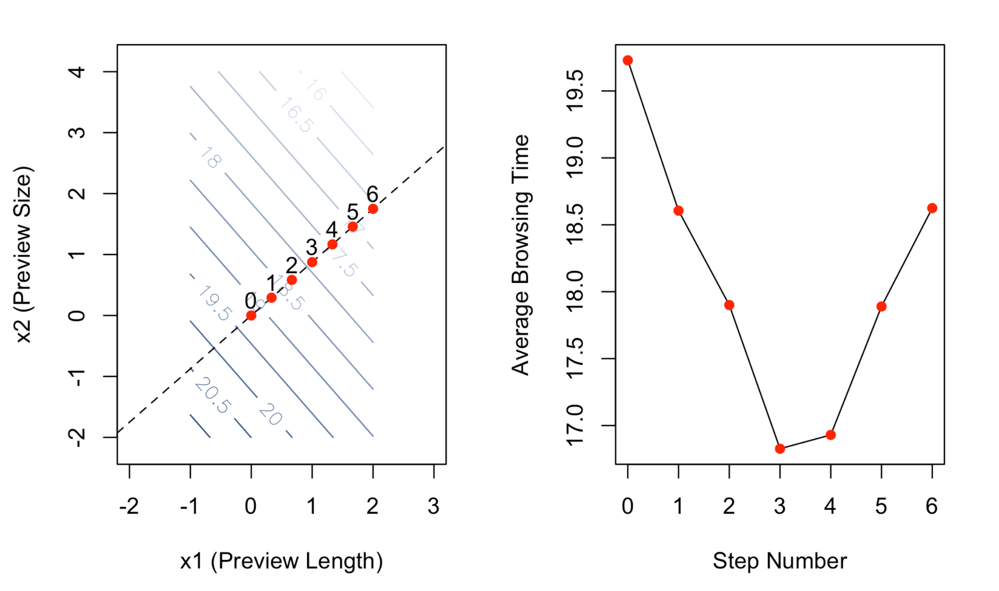

[< Back to the portfolio](https://s-bishnoi.github.io/shubham-bishnoi/)

# Experimental Design

### Summary

The project is on experimenting with different features of the online streaming service to reduce the average browsing time. They generates revenue when users stream something online by minimal browsing. Due to so many options, users often get overwhelmed and end up watching nothing. Therefore, the purpose of this experiment is to find the combination of optimum values of preview length, preview size and tile size to minimize the average browsing time, thereby resulting in quicker user selection.

Three factors will be explored in this project; Tile Size, Preview Size, and Preview length. Tile size is the ratio of a tile’s height to the overall screen height, preview size is the ratio of the preview window’s height to the overall screen height and preview length is the duration (in seconds) of a show or movie’s preview.

The optimum value turns out to be

| Average Browsing Time | Preview.Length | Preview.Size | Tile.Size |
| :---: | :---: | :---: | :---: |
| 15 minutes and 45 seconds | 90 | 0.65 | 0.2 |


#### Load helpful packages and functions

```
library(plot3D)
library(gplots)

# Function to create blues
blue_palette <- colorRampPalette(c(rgb(247,251,255,maxColorValue = 255), rgb(8,48,107,maxColorValue = 255)))

# Function for converting from natural units to coded units
convert.N.to.C <- function(U,UH,UL){
  x <- (U - (UH+UL)/2) / ((UH-UL)/2)
  return(x)
}

# Function for converting from coded units to natural units
convert.C.to.N <- function(x,UH,UL){
  U <- x*((UH-UL)/2) + (UH+UL)/2
  return(U)
}
```

### Phase 1: Factor Screening

The objective of this phase of the experiment is to figure out if any of the factors Tile.Size, Prev.Size, and Prev.Length are significantly important for *Average Browsing Time* response. The 2^K = 2^3 factorial experiment was used because 2^(3-1) will lead to resolution III. In resolution III, every main effect would have been confounded with a two-factor interaction. It is difficult to differentiate the significance achieved through main effects or the interactions in the linear model in lower resolution.

```
netflix.ph1 <- read.csv(file = "./factor_screening.csv", header = T)

ph0 <- data.frame(y = netflix.ph1$Browse.Time,
                  x1 = convert.N.to.C(U = netflix.ph1$Prev.Length, UH = 90, UL = 30),
                  x2 = convert.N.to.C(U = netflix.ph1$Prev.Size, UH = 0.5, UL = 0.3),
                  x3 = convert.N.to.C(U = netflix.ph1$Tile.Size, UH = 0.3, UL = 0.1))

par(mfrow=c(2,3)) 
plotmeans(formula = y~x3, ylab = "Average Browsing Time", xlab = "Tile.Size", 
          data = ph0, xaxt = "n", pch = 16,ylim = c(16,21))
axis(side = 1, at = c(1,2), labels = c("0.1", "0.3"))
plotmeans(formula = y~x2, ylab = "Average Browsing Time", xlab = "Prev.Size", 
          data = ph0, xaxt = "n", pch = 16,ylim = c(16,21))
axis(side = 1, at = c(1,2), labels = c("0.3", "0.5"))
plotmeans(formula = y~x1, ylab = "Average Browsing Time", xlab = "Prev.Length", 
          data = ph0, xaxt = "n", pch = 16,ylim = c(16,21))
axis(side = 1, at = c(1,2), labels = c("30", "90"))
```

[](./p11.png)

The plots of preview size and preview length shows that the average browsing time decreases as we go from their respective lows to highs. On the other hand, in the plot for title size, we can see that going from 0.1 to 0.3 doesn't much effect the average browsing time. This leads us to believe that the title size might be insignificant. We will test the null hypotesis if title size is relevant or not.

```
## Fit a full model with all main effects and interaction terms
model <- lm(y ~ x1 * x2 * x3, data = ph0)

## Fit a reduced model with just the main effects and interactions that appear to be significant
model_red <- lm(y ~ x1 + x2 + x1:x2, data = ph0)

anova(model_red,model)
```

[](./p12.png)

We fail to reject the null hypothesis that both the models fits the data equally well. Therefore, we will be dropping the tile size for the rest of the experiment.

### Phase 2: Method of Steepest Descent

The objective of this part of the experiment is to figure out if we are in the presence of quadratic curvature, which further signifies that we are in the vicinity of the optimum. We start by getting a center point condition based on our factor screening data. We can't calculate the coefficients for quadratic terms for the data, but we can calculate the sum of quadratic terms by xPQ.

```
netflix.ph2 <- rbind(netflix.ph1,read.csv("./centre_data.csv", header = TRUE))

ph2 <- data.frame(y = netflix.ph2$Browse.Time,
                  x1 = convert.N.to.C(U = netflix.ph2$Prev.Length, UH = 90, UL = 30),
                  x2 = convert.N.to.C(U = netflix.ph2$Prev.Size, UH = 0.5, UL = 0.3))

ph2$xPQ <- (ph2$x1^2 + ph2$x2^2)/2
```
We fit the the second order linear predictor model,

```
## Check to see if that's significant
m <- lm(y~x1+x2+x1*x2+xPQ, data = ph2)
summary(m)
```

[](./p21.png)

We test the null hypothesis for coefficient of curvature being zero, 

**p-value = P(T >= \|t\|) = 0.352** where t is test statistic value -0.931 and T is Normally distributed. 

We fail to reject the null hypothesis and hence we are not in the presence of quadratic curvature, therefore we will try to find the curvature by calculating gradient (g), step size (lambda) and new x (x') until x' becomes out of range.

g = [-0.74183, -0.64929]

lambda = (1/3)/(\|-0.74183\|) (the value 1/3 was chosen to ensure steps of 10 seconds in Preview Lengths)

x' = x - lambda * g 

| Step | Preview.Length | Preview.Size |
| :---: | :---: | :---: |
| 0 | 60 | 0.4000000 |
| 1 | 70 | 0.4291750 |
| 2 | 80 | 0.4583499 |
| 3 | 90 | 0.4875249 |
| 4 | 100 | 0.5166998 |
| 5 | 110 | 0.5458748 |
| 6 | 120 | 0.5750498 |


```
m.fo <- lm(y~x1+x2, data = ph2)
beta0 <- coef(m.fo)[1]
beta1 <- coef(m.fo)[2]
beta2 <- coef(m.fo)[3]
grd <- mesh(x = seq(convert.N.to.C(U = 30, UH = 90, UL = 30), 
                    convert.N.to.C(U = 120, UH = 90, UL = 30), 
                    length.out = 100), 
            y = seq(convert.N.to.C(U = 0.2, UH = 0.5, UL = 0.3), 
                    convert.N.to.C(U = 0.8, UH = 0.5, UL = 0.3), 
                    length.out = 100))
x1 <- grd$x
x2 <- grd$y
eta.fo <- beta0 + beta1*x1 + beta2*x2
# 2D contour plot
par(mfrow = c(1,2))
contour(x = seq(convert.N.to.C(U = 30, UH = 90, UL = 30), 
                convert.N.to.C(U = 120, UH = 90, UL = 30), 
                length.out = 100),
        y = seq(convert.N.to.C(U = 0.2, UH = 0.5, UL = 0.3), 
                convert.N.to.C(U = 0.8, UH = 0.5, UL = 0.3), 
                length.out = 100), 
        z = eta.fo, xlab = "x1 (Preview Length)", ylab = "x2 (Preview Size)",
        nlevels = 15, col = blue_palette(15), labcex = 0.9, asp=1, xlim = c(-2,3))
abline(a = 0, b = beta2/beta1, lty = 2)
points(x = 0, y = 0, col = "red", pch = 16)
g <- matrix(c(beta1, beta2), nrow = 1)

PL.step <- convert.N.to.C(U = 60 + 10, UH = 90, UL = 30)
lamda <- PL.step/abs(beta1)

## Step 0: The center point we've already observed
x.old <- matrix(0, nrow=1, ncol=2)
text(x = 0, y = 0+0.25, labels = "0")
step0 <- data.frame(Prev.Length = convert.C.to.N(x = 0, UH = 90, UL = 30), 
                    Prev.Size = convert.C.to.N(x = 0, UH = 0.5, UL = 0.3))

## Step 1: 
x.new <- x.old - lamda*g
points(x = x.new[1,1], y = x.new[1,2], col = "red", pch = 16)
text(x = x.new[1,1], y = x.new[1,2]+0.25, labels = "1")
step1 <- data.frame(Prev.Length = convert.C.to.N(x = x.new[1,1], UH = 90, UL = 30), 
                    Prev.Size = convert.C.to.N(x = x.new[1,2], UH = 0.5, UL = 0.3))

## Step 2: 
x.old <- x.new
x.new <- x.old - lamda*g
points(x = x.new[1,1], y = x.new[1,2], col = "red", pch = 16)
text(x = x.new[1,1], y = x.new[1,2]+0.25, labels = "2")
step2 <- data.frame(Prev.Length = convert.C.to.N(x = x.new[1,1], UH = 90, UL = 30), 
                    Prev.Size = convert.C.to.N(x = x.new[1,2], UH = 0.5, UL = 0.3))

## Step 3: 
x.old <- x.new
x.new <- x.old - lamda*g
points(x = x.new[1,1], y = x.new[1,2], col = "red", pch = 16)
text(x = x.new[1,1], y = x.new[1,2]+0.25, labels = "3")
step3 <- data.frame(Prev.Length = convert.C.to.N(x = x.new[1,1], UH = 90, UL = 30), 
                    Prev.Size = convert.C.to.N(x = x.new[1,2], UH = 0.5, UL = 0.3))

## Step 4: 
x.old <- x.new
x.new <- x.old - lamda*g
points(x = x.new[1,1], y = x.new[1,2], col = "red", pch = 16)
text(x = x.new[1,1], y = x.new[1,2]+0.25, labels = "4")
step4 <- data.frame(Prev.Length = convert.C.to.N(x = x.new[1,1], UH = 90, UL = 30), 
                    Prev.Size = convert.C.to.N(x = x.new[1,2], UH = 0.5, UL = 0.3))

## Step 5: 
x.old <- x.new
x.new <- x.old - lamda*g
points(x = x.new[1,1], y = x.new[1,2], col = "red", pch = 16)
text(x = x.new[1,1], y = x.new[1,2]+0.25, labels = "5")
step5 <- data.frame(Prev.Length = convert.C.to.N(x = x.new[1,1], UH = 90, UL = 30), 
                    Prev.Size = convert.C.to.N(x = x.new[1,2], UH = 0.5, UL = 0.3))

## Step 6: 
x.old <- x.new
x.new <- x.old - lamda*g
points(x = x.new[1,1], y = x.new[1,2], col = "red", pch = 16)
text(x = x.new[1,1], y = x.new[1,2]+0.25, labels = "6")
step6 <- data.frame(Prev.Length = convert.C.to.N(x = x.new[1,1], UH = 90, UL = 30), 
                    Prev.Size = convert.C.to.N(x = x.new[1,2], UH = 0.5, UL = 0.3))

netflix.ph2.1 <- read.csv("./gradient_part.csv", header = TRUE)

## Calculate the average browsing time in each of these conditions and find the condition that minimizes it
pstd.means <- aggregate(netflix.ph2.1$Browse.Time, 
                        by = list(Prev.Length = netflix.ph2.1$Prev.Length, 
                                  Prev.Size = netflix.ph2.1$Prev.Size), 
                        FUN = mean)

plot(x = 0:6, y = pstd.means$x,
     type = "l", xlab = "Step Number", ylab = "Average Browsing Time")
points(x = 0:6, y = pstd.means$x,
       col = "red", pch = 16)
```


[](./p22.png)

The plot above on the right depicts the average browsing time for the six steps that we took. Clearly, Step 3 corresponded to the lowest observed average browsing time. Therefore we should perform another test of curvature in this region to determine whether we have reached the vicinity of the optimum.

In order to do so, another 2^2 factorial experiment with a center point was ran. The factor levels in coded and natural units for this next experiment are shown in the table below.

| Condition | Preview.Length | x1 | Preview.Size | x2 |
| :---: | :---: | :---: | :---: | :---: |
| 1 | 80 | -1 | 0.5875 | +1 | 
| 2 | 80 | -1 | 0.3875 | -1 | 
| 3 | 100 | +1 | 0.5875 | +1 | 
| 4 | 100 | +1 | 0.3875 | -1 | 
| 5 | 90 | 0 | 0.4875 | 0 | 


```

netflix.ph2.2 <- rbind(read.csv("./recentre_again.csv"),
                    netflix.ph2.1[netflix.ph2.1$Prev.Length == 90,])

ph2.2 <- data.frame(y = netflix.ph2.2$Browse.Time,
                    x1 = round(convert.N.to.C(U = netflix.ph2.2$Prev.Length, UH = 100, UL = 80),1),
                    x2 = round(convert.N.to.C(U = netflix.ph2.2$Prev.Size, UH = 0.5875249, UL = 0.3875249),1))

ph2.2$xPQ <- (ph2.2$x1^2 + ph2.2$x2^2)/2

## Check to see if that's significant
m <- lm(y~x1+x2+x1*x2+xPQ, data = ph2.2)
summary(m)
```

[](./p23.png)

We again test the null hypothesis for oefficient of curvature being zero, 

**p-value = P(T >= \|t\|) = 0.0000318** where t is test statistic value 4.176  and T is Normally distributed.

We reject the null hypothesis that there is no curvature and hence we are in the presence of quadratic curvature. This investigation is followed up by a response surface experiment so that a full second order model may be fit and the optimum identified.

### Phase 3: Response Optimization