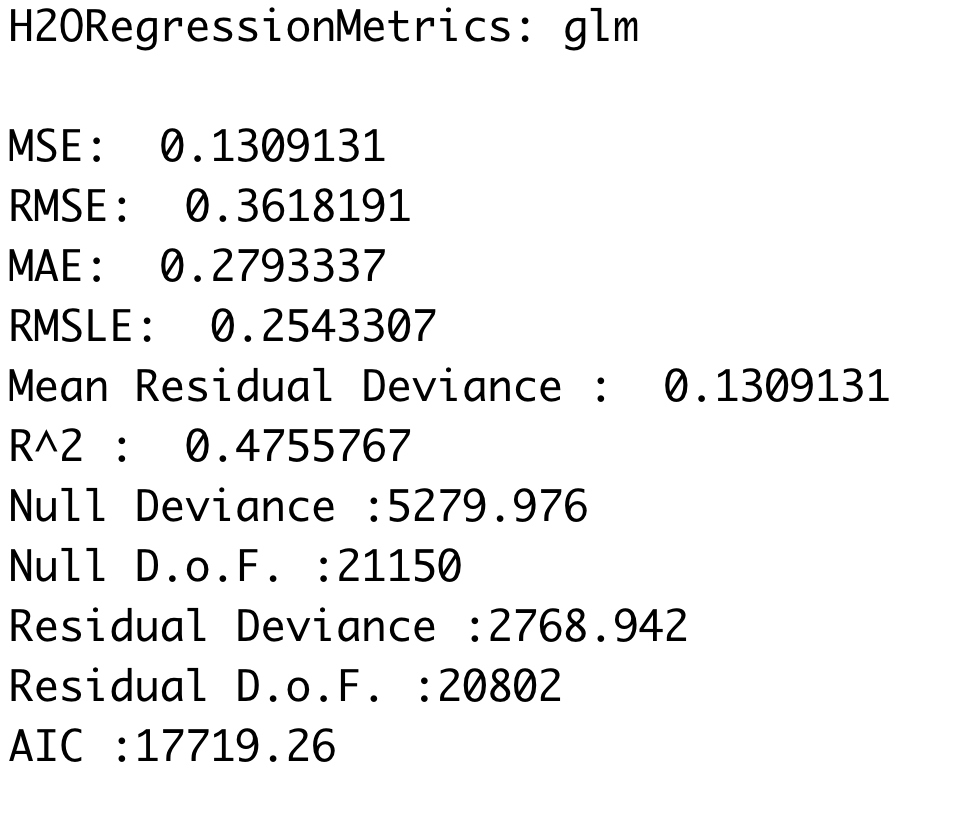
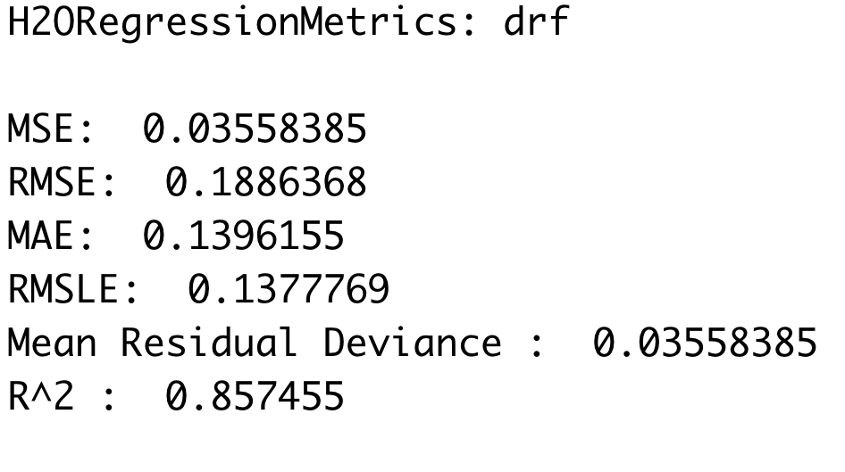
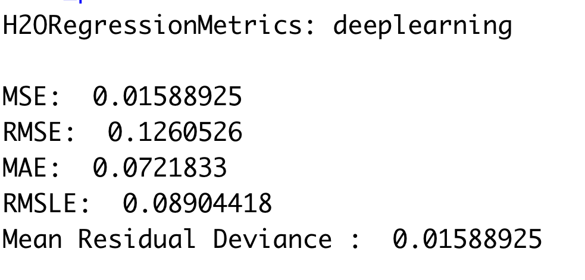
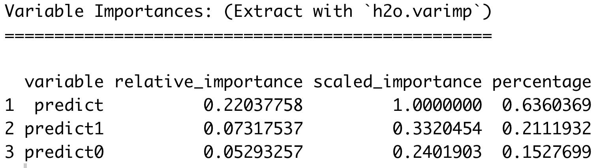

[< Back to the portfolio](https://s-bishnoi.github.io/shubham-bishnoi/)

[< Back to the projects](https://s-bishnoi.github.io/shubham-bishnoi/projects/)

# Prediction Model

- Feature Engineering
- GLM in h2o
- Random forest model in h2o
- Deep learning model in h2o
- Stacking
- Results

**Note: This project was done in a group of two including myself and [Danielle Won](https://github.com/daniellewon)**

## Feature Engineering

There are 271 features that lead to response variable of happy or not happy. 5 more features were added:
 - v271: Binary response of the person's occupation and partner's occupation being the same or not
 - v272: Ratio of the number of hours worked by the person (v251) and their partner (v252).
 - v273: Binary response of the person and their partner being employed the same way or not
 - v274: Binary response of the person and their partner having same higher education or not
 - v275: Binary response of the person ever changing their religion or not

Combining few distributed time columns into one column
 - v276: Time of supplementary questionnaire
 - v277: Start of the interview
 - v278: End of the interview

```
data$v271 <- 0
data$v272 <- 0
data$v273 <- 0
data$v274 <- 0
data$v275 <- 0
data$v276 <- as.Date("1.1.0001",format = "%d.%m.%Y")
data$v277 <- as.Date("1.1.0001",format = "%d.%m.%Y")
data$v278 <- as.Date("1.1.0001",format = "%d.%m.%Y")

for (i in 1:NROW(data)){
  data$v271[i] = data$v150[i] == data$v151[i]

  if (data$v251[i] == '.a' | data$v251[i] == '.b' | 
      data$v251[i] == '.c' | data$v251[i] == '.d' | 
      data$v251[i] == '.' | is.na(data$v251[i])){
    if (data$v252[i] == '.a' | data$v252[i] == '.b' | 
        data$v252[i] == '.c' | data$v252[i] == '.d' | 
        data$v252[i] == '.' | is.na(data$v252[i])){
      data$v272[i] = NA
    }
  } else{
    data$v272[i] = as.integer(data$v251[i]) / as.integer(data$v252[i])
  }
  
  data$v273[i] = data$v70[i] == data$v71[i]
  
  data$v274[i] = data$v65[i] == data$v68[i]
  
  data$v275[i] = data$v190[i] == data$v191[i]
  
  data$v276[i] = as.Date(paste(toString(data$v228[i]),toString(data$v229[i]) ,
                               toString(data$v230[i]),sep = "."),format = "%d.%m.%Y")
  
  data$v277[i] = as.Date(paste(toString(data$v125[i]),toString(data$v129[i]) ,
                               toString(data$v134[i]),sep = "."),format = "%d.%m.%Y")
  
  data$v278[i] = as.Date(paste(toString(data$v124[i]),toString(data$v128[i]) ,
                               toString(data$v133[i]),sep = "."),format = "%d.%m.%Y")
}
```
## GLM in h2o

First we will have to covert the R dataframe in to h2o dataframe to use it further. The h2o dataframe will be split into three h2o dataframes named train, valid and test.

```
dataH2o <- as.h2o(data)
splits <- h2o.splitFrame(data = dataH2o,ratios = c(0.7, 0.15),seed = 2020)

train <- splits[[1]]
valid <- splits[[2]]
test <- splits[[3]]
x <- setdiff(names(dataH2o),c("id","satisfied"))
y <- "satisfied"
```

Fitting the GLM model

```
glm_fit1 <- h2o.glm(x = x,
                   y = y,
                   training_frame = train,
                   model_id = "glm_fit1",
                   family = "gaussian",
                   lambda_search = TRUE)
```

Checking the fit

```
glm_perf1 <- h2o.performance(model = glm_fit1,
                            newdata = train)
glm_perf1
```
[](./p1.png)

## Random forest model in h2o

Fitting the random forest model

```
rf_fit1 <- h2o.randomForest(x = x,
                            y = y,
                            training_frame = train,
                            model_id = "rf_fit1",
                            ntrees = 100,
                            max_depth = 10,
                            seed = 2020)
```

Checking the fit

```
rf_perf1 <- h2o.performance(model = rf_fit1,
                            newdata = train)
rf_perf1
```

[](./p2.png)

## Deep learning model in h2o

Fitting the deep learning model

```
dl_fit1 <- h2o.deeplearning(x = x,
                             y = y,
                             training_frame = train,
                             model_id = "dl_fit1",
                             seed = 2020)
```

Checking the fit

```
dl_perf1 <- h2o.performance(model = dl_fit1,
                            newdata = train)
dl_perf1
```

[](./p3.png)

## Stacking

We will combine all the last three models

```
p1 <- predict(glm_fit1,new = valid[,(colnames(valid) %in% x)])
p2 <- predict(rf_fit1,new = valid[,(colnames(valid) %in% x)])
p3 <- predict(dl_fit1,new = valid[,(colnames(valid) %in% x)])

trueValue <- as.h2o(valid$satisfied)
prediction <- h2o.cbind(trueValue, p1$predict,p2$predict,p3$predict)

newModel <- h2o.glm(x = c("predict","predict0","predict1"),
                    y = "satisfied",
                    training_frame = prediction,
                    model_id = "glm_fitNew",
                    family = "gaussian",
                    lambda_search = TRUE)

summary(newModel)
```
[](./p4.png)

According to this, GLM model is used with 63.6% importance, Random forest model is used with 21.1% importance and Deep learning model is used with 15.3% importance.

## Results

To get the results,

```
pN1 <- predict(glm_fit1,new = test[,(colnames(test) %in% x)])
pN2 <- predict(rf_fit1,new = test[,(colnames(test) %in% x)])
pN3 <- predict(dl_fit1,new = test[,(colnames(test) %in% x)])

prediction2 <- h2o.cbind(pN1$predict,pN2$predict,pN3$predict)
testPrediction <- predict(newModel,new = prediction2)

final <- testPrediction
final[final <= 0.5] <- 0
final[final > 0.5] <- 1
  
result <-  h2o.cbind(test$satisfied,final)
df = as.data.frame(result)

sum = 0
for (i in 1:NROW(df)){
  if (df[i,1] == df[i,2]){
    sum = sum + 1
  }
}
sum/NROW(df)
```

It gives the 80.81% accuracy for the prediction.

