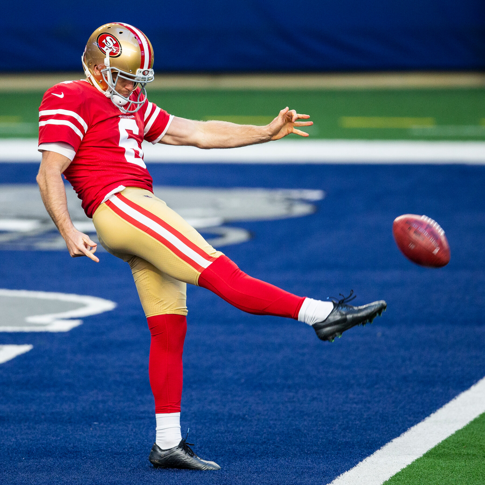

[< Back to Overview](https://s-bishnoi.github.io/shubham-bishnoi/)

### Project: Experimental Design

**Description:** This project experiments with different features of an online streaming service to reduce the average browsing time.

**Tools & Methods:** A/B Testing and Hypothesis testing in R

-------------------------------------

### Project: Solution finding

**Description:** This project proposes specific rule modifications (e.g. changes to the initial formation, tackling techniques, blocking rules etc.), supported by data, that may reduce the occurrence of concussions during punt plays in NFL.

**Tools & Methods:** R (dplyr, DBI, ggplot2, plotly, gapminder), Python (Spark), and SQLite

-------------------------------------

### Project: Prediction Model 

**Description:** This project creates a prediction model for happiness of people based on given attributes. The achieved accuracy was 80.81%.

**Tools & Methods:** Feature Engineering, Generalized Linear Model, Random Forest Model, Deep Learning Model and Stacking in R using h2o library

[Link](./ExperimentalDesign/) 

[Link](./nfl/Case_Study_NFL_Shubham_Bishnoi.html)
[Link](./PredictionClassificationModels)