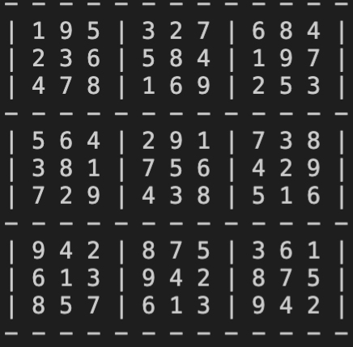
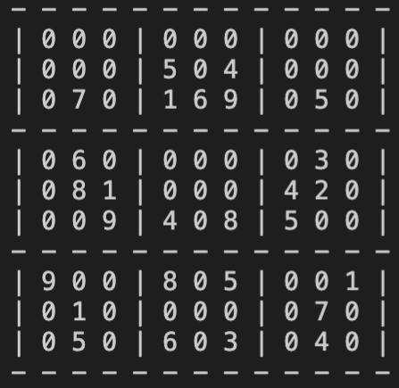

[< Back to the portfolio](https://s-bishnoi.github.io/shubham-bishnoi/)

# Recursive Algorithm

```
# Solving Sudoku

# Finding the empty index
def find_empty(myBoard):
    for i in range(len(myBoard)):
        for j in range(len(myBoard[i])):
            if myBoard[i][j] == 0:
                return (i, j)  # row, col
    return None

# Printing the board
def print_board(myBoard):
    for i in range(len(myBoard)):
        if i % 3 == 0:
            print("- - - - - - - - - - - - -")

        for j in range(len(myBoard[i])):
            if j % 3 == 0:
                print("| ",end="")
            if j == 8:
                print(str(myBoard[i][j]) + " |")
            else:
                print(str(myBoard[i][j]) + " ", end="")
    print("- - - - - - - - - - - - -")

# Solving recursively
def solve(myBoard):
    find = find_empty(myBoard)
    if not find:
        return True
    else:
        row, col = find

    for i in range(1,10):
        if valid(myBoard, i, (row, col)):
            myBoard[row][col] = i
            if solve(myBoard):
                return True
            myBoard[row][col] = 0

    return False

# Checking if the num is valid in that position
def valid(myBoard, num, pos):
    # Check row
    for i in range(len(myBoard[0])):
        if myBoard[pos[0]][i] == num and pos[1] != i:
            return False
    # Check column
    for i in range(len(myBoard)):
        if myBoard[i][pos[1]] == num and pos[0] != i:
            return False
    # Check box
    box_x = pos[1] // 3
    box_y = pos[0] // 3

    for i in range(box_y*3, box_y*3 + 3):
        for j in range(box_x * 3, box_x*3 + 3):
            if myBoard[i][j] == num and (i,j) != pos:
                return False

    return True

```

Here is the example for the solver

```
board = [
        [0, 0, 0, 0, 0, 0, 0, 0, 0],
        [0, 0, 0, 5, 0, 4, 0, 0, 0],
        [0, 7, 0, 1, 6, 9, 0, 5, 0],
        [0, 6, 0, 0, 0, 0, 0, 3, 0],
        [0, 8, 1, 0, 0, 0, 4, 2, 0],
        [0, 0, 9, 4, 0, 8, 5, 0, 0],
        [9, 0, 0, 8, 0, 5, 0, 0, 1],
        [0, 1, 0, 0, 0, 0, 0, 7, 0],
        [0, 5, 0, 6, 0, 3, 0, 4, 0]
    ]

print_board(board)
```

[](./complete.png)

```
solve(board)
print_board(board)
```
[](./incomplete.png)

This runs in 3 seconds
